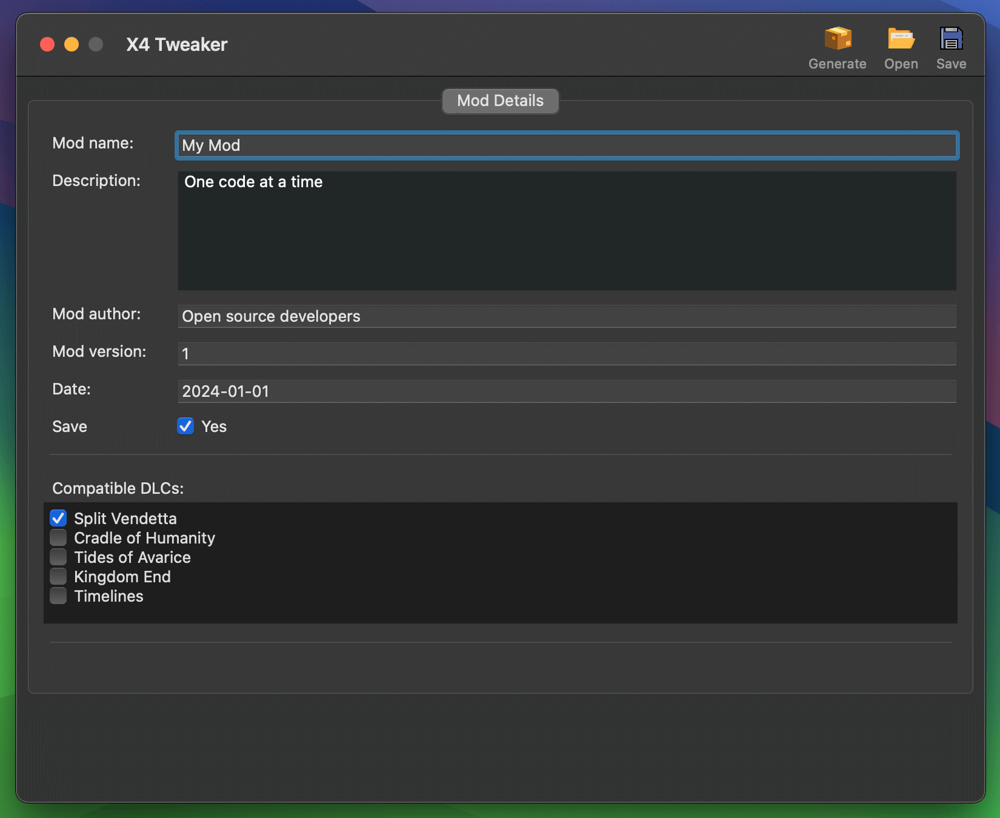

<div align="center" style="display:grid;place-items:center;">
<p>
    
</p>

<h1>X4 Tweaker</h1>


<h4>Cross platform desktop mod template generator for X4: Foundations</h4>
</div>

<p align="middle">
    
</p>


## About

X4 Tweaker enables you to easily create your own mod configs for X4: Foundations with a simple desktop application.

> [!NOTE]
> This project is a work in progress and no releases are available yet. If you wish to use the tool, you can build it from the source code by cloning the repository and following the developer's guide.

## Supported Platforms

X4 Tweaker is available for the following platforms:

<p align="left">
    
    
    
</p>

## Technologies

<p align="left">
    
    
</p>

## Developer's guide

### 0. Prerequisites

- Install Python 3.8+

### 1. Setup

#### Make a Python virtual environment:

<details><summary>macOS</summary>

```bash
python3 -m venv beeware-venv
```

</details>

<details><summary>Windows</summary>

```bash
py -m venv beeware-venv
```

</details>

<details><summary>Linux</summary>

```bash
python3 -m venv beeware-venv
```

</details>

#### Activate the virtual environment:

<details><summary>macOS</summary>

```bash
source beeware-venv/bin/activate
```

</details>

<details><summary>Windows</summary>

```bash
beeware-venv\Scripts\activate
```

</details>

<details><summary>Linux</summary>

```bash
source beeware-venv/bin/activate
```

</details>

#### Install dependencies:

```bash
pip install -r requirements.txt
```

### 2. Run

Run in watch mode:

```bash
watchmedo auto-restart -p "*.py" -R briefcase dev
```

Run in dev mode:

```bash
briefcase dev
```

Run in production mode:

```bash
briefcase run -u
```

### 3. Update dependencies:

```bash
pip freeze > requirements.txt
```

### 4. Build the app:

Create the application scaffold

```bash
briefcase create
```

Build the application

```bash
briefcase build
```

Update the built application

```bash
briefcase update
```

---

## Disclaimer

> [!WARNING]
> X4 Tweaker is a fan-made tool for modifying X4: Foundations for educational purposes only. It is not affiliated with or endorsed by Egosoft. The purpose of this project is to demonstrate how cross platform desktop native applications can be built using Python and to educate the community by providing examples. This tool shall never be used for cheating in the game. Use it at your own risk.
